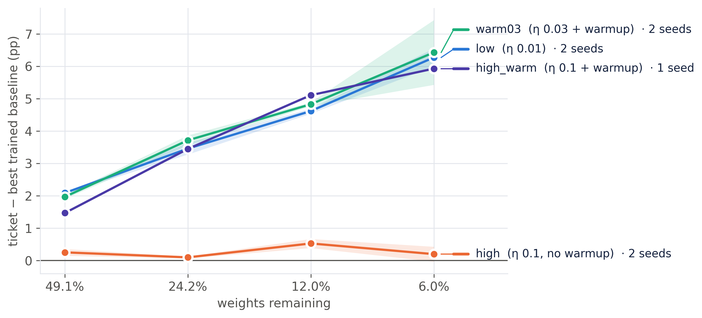
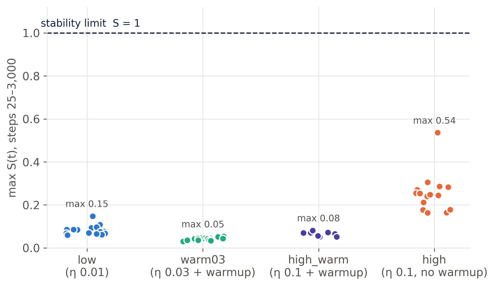
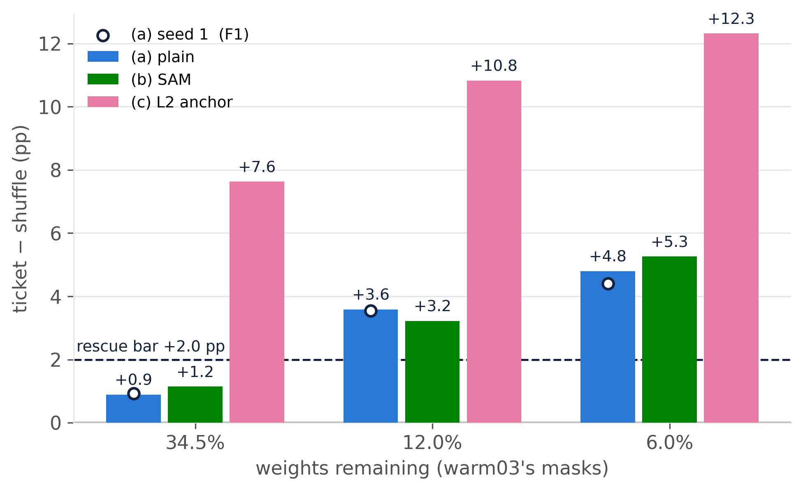
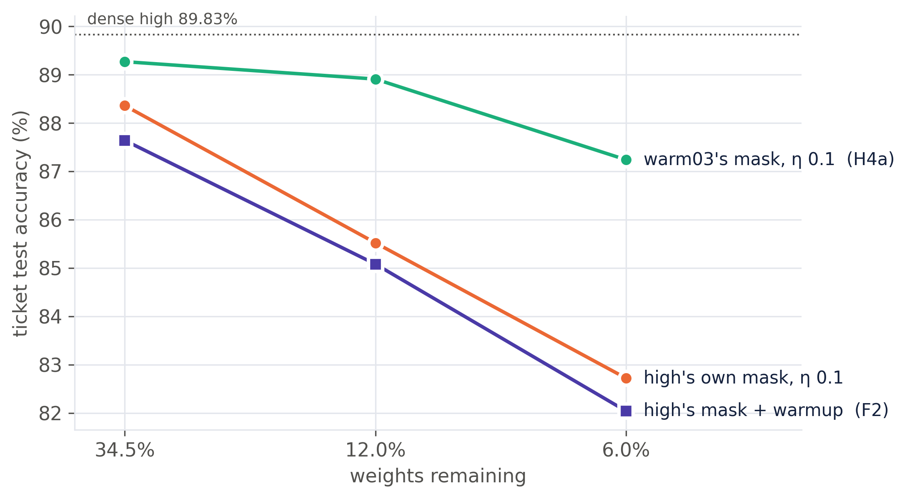

## Abstract

Frankle & Carbin (2019) found that deep networks only yield winning lottery tickets at a small learning rate or with
learning-rate warmup, and left the reason open. We test two explanations from the literature. The first says that without warmup,
early training crosses the stability limit η·λ~max~ ≈ 2 + 2β (sharpness). The second, from Liu et al. (2021), says that a large learning
rate decorrelates the trained weights from their initialization (weight correlation). On ResNet-20 / CIFAR-10 with iterative magnitude pruning
down to 6% of weights, we replicate the phenomenon on two seeds. Tickets beat trained baselines by +2 to +6.4 pp at η = 0.01 and at η = 0.03 with
warmup, but by at most +0.5 pp at η = 0.1 without warmup. Neither explanation survives. No run comes near the stability limit
(max S = 0.54). In a pre-registered causal test, the good masks found with warmup, trained at η = 0.1 with no warmup,
**still win** (+3.6 and +4.8 pp over shuffled controls), despite the same early sharpness transient and near-chance weight correlation.
Lowering sharpness with SAM changes nothing, and forcing correlation with an L2 anchor does not improve the ticket.
<!--F-ABSTRACT-->
High-learning-rate training does not break the ticket. It breaks **iterative magnitude pruning's choice of mask**.

## 1. Introduction

The lottery ticket hypothesis (Frankle & Carbin, 2019) states that a dense network contains a sparse subnetwork, the *winning ticket*.
Reset to its original initialization θ₀ and trained alone, the ticket matches the dense network. Tickets are found by iterative
magnitude pruning (IMP): train, prune the smallest weights, rewind the survivors to θ₀, repeat. On deeper networks (VGG-19, ResNet-18) this only
works at a small learning rate or with warmup; at the standard rate the "ticket" is no better than a random reinitialization. Why warmup is
needed was left open.

Two later lines of work give candidate answers:

- **Sharpness / stability.** Gradient descent is stable only while η·λ~max~ stays below a threshold (2 + 2β for heavy-ball momentum).
  Cohen et al. (2021) showed that training self-stabilizes at this "edge of stability", and Kalra & Barkeshli (2024) showed that warmup acts
  by letting the network move to flatter regions before the learning rate is large. If a sparse ticket starts sharper, or crosses
  the threshold early, its training might be disrupted in a way that loses what made it special.
- **Weight correlation.** Liu et al. (2021) argue that tickets exist only when training keeps the final weights θ~T~ correlated
  with θ₀ (overlap R~p~ of the largest weights). A large learning rate moves the weights further and destroys that correlation.

The observational data in this setting cannot separate these explanations: in Frankle's results, warmup lowers early sharpness **and**
preserves correlation **and** lowers the average learning rate. We therefore add a causal test in which the mask is held fixed
and each mechanism is manipulated on its own.

## 2. Hypotheses

- **H1 (replication).** On ResNet-20 / CIFAR-10, tickets beat a randomly reinitialized network at η = 0.01 and with warmup (η = 0.03),
  but not at η = 0.1 without warmup.
- **H2 (stability ratio).** Where tickets fail, the stability ratio S(t) = η~t~·λ~max~(t)/(2 + 2β), measured in early training, reaches about 1.
  Where tickets win, S stays clearly below 1. Sharpness at initialization alone is not expected to predict this.
- **H3 (warmup mechanism).** Warmup keeps S below 1 through the high-learning-rate phase, and this coincides with the return of the ticket advantage.
- **H4 (causal test).** Take the good masks from the warmup chain and train them at η = 0.1 (a) with no warmup, (b) with SAM, which lowers
  sharpness, and (c) with an L2 anchor to θ₀, which raises correlation. If (b) rescues the ticket and (c) does not, that supports sharpness;
  the reverse supports Liu et al.

## 3. Methods

**Data and model.** CIFAR-10 is split into 45,000 training and 5,000 validation images, plus the official 10,000-image test set (used only
for reported numbers). Augmentation is random crop with 4-px padding and horizontal flip. The model is ResNet-20 (3 stages × 3 basic blocks,
16/32/64 channels, BatchNorm, 0.27 M parameters).

**Training.** SGD with momentum β = 0.9, batch 128, weight decay 10⁻⁴, 15,000 iterations (≈ 38 epochs), learning rate × 0.1 at 10k and 12.5k,
fp16 mixed precision. Four conditions:

| Condition | η | Warmup | Role |
|---|---|---|---|
| low | 0.01 | none | tickets expected to win |
| high | 0.1 | none | tickets expected to fail |
| warm03 | 0.03 | linear over 10k steps | Frankle's successful ResNet setting |
| high_warm | 0.1 | linear over 10k steps | the same peak rate as high, with warmup |

**IMP.** Each round prunes 30% of the surviving conv and linear weights globally by magnitude; the final layer is pruned at half the rate and the
first conv layer is never pruned. The survivors are reset to the exact θ₀ (no rewinding). Eight rounds give 100% down to 6.0% of weights remaining.
The mask is re-applied to the weights and the momentum buffers after every step.

**Baselines.** At the same mask: **reinit** (fresh random initialization; rounds 2, 4, 6, 8) and **shuffle** (θ₀ permuted within each layer
over the surviving positions, which keeps each layer's weight distribution; rounds 4 and 8). The **ticket advantage** is the ticket's
test accuracy minus the best trained baseline's. A **winning ticket** needs advantage > 0 (with two seeds, mean > 2 SE) *and* accuracy within
0.5 pp of the dense network of its condition.

**Sharpness.** λ~max~ of the training loss on a fixed batch of 2,048 images, by 10-step Lanczos with full reorthogonalization on masked
Hessian-vector products (fp32). It is measured at steps 0, 25, 50, 100, 200, every 500 to 3,000, then every 3,000 (15 points per run).
The H2 statistic is **max S over steps 25–3,000**; S(0) is reported separately because it measures the initialization, not training.
(Power iteration converged to the most negative eigenvalue on ResNet-20, so we switched to Lanczos.)

**Weight correlation.** R~p~ (Liu et al., 2021): the share of the top-p surviving weights by |θ₀| that are also in the top-p by |θ~T~|,
pooled over layers. Chance is ≈ p; we report R~0.2~.

**H4 design.** Masks and θ₀ come from warm03 seed 0 at rounds 3, 6 and 8 (34.5, 12.0 and 6.0% remaining). Each mask is trained as ticket and
shuffle at η = 0.1 with no warmup: (a) plain, (b) SAM with ρ = 0.05, the perturbation restricted to the mask, and (c) an L2 anchor
(λ/2)·‖m ⊙ (θ − θ₀)‖². λ was chosen before the main runs as the smallest value in {10⁻³, 10⁻²} whose R~0.2~ at step 3,000 reached the low
condition's level (0.661); λ = 10⁻² reached 0.757. **The decision rule was fixed and committed before any H4 result:** an intervention rescues
the ticket if ticket − shuffle ≥ +2.0 pp at ≥ 2 of the 3 masks, *and* it moved its target variable relative to (a) (SAM lowers max S; the anchor
raises R~0.2~ at step 3,000). The 2.0 pp bar sits above everything the failing high chain produced (≤ +0.7 pp).

**Scale and compute.** Seeds 0 and 1 for low, high and warm03; seed 0 for high_warm and H4; 141 trainings in all<!--F-COUNT-->,
on one NVIDIA T4 (Colab), three processes in parallel under CUDA MPS. Total ≈ <!--F-HOURS--> of a 30-hour budget.

## 4. Results

### 4.1 H1: replication, supported

At η = 0.01 and at η = 0.03 with warmup, tickets beat their trained baselines at every sparsity, by more as sparsity grows:
low +2.09 / +3.46 / +4.62 / +6.27 pp and warm03 +1.97 / +3.72 / +4.83 / +6.43 pp at 49.1 / 24.2 / 12.0 / 6.0% remaining (two-seed means).
At η = 0.1 without warmup the advantage collapses to +0.26 / +0.10 / +0.53 / +0.20 pp, with tickets 0.8 to 7.2 pp below their dense network:
**no winning ticket on either seed**. Adding warmup at the same peak rate (high_warm) restores it: +1.47 / +3.45 / +5.11 / +5.93 pp,
winning at 3 of 4 sparsities. The two seeds agree within 0.6 pp on every advantage except warm03 at 6.0% (+7.43 vs +5.43 pp).

Table 1 gives the rubric's metrics for the dense networks and two ticket sparsities (test set, mean ± SD over seeds).

| Condition | Network | Acc | Precision | Recall | F1 | AUC |
|---|---|---|---|---|---|---|
| low | dense | 86.57 ± 0.13 | 86.59 | 86.57 | 86.56 | 0.9894 |
| low | ticket 34.5% | 88.00 ± 0.18 | 87.99 | 88.00 | 87.98 | 0.9915 |
| low | ticket 6.0% | 86.18 ± 0.06 | 86.15 | 86.18 | 86.12 | 0.9888 |
| high | dense | 89.69 ± 0.20 | 89.66 | 89.69 | 89.67 | 0.9933 |
| high | ticket 34.5% | 88.23 ± 0.18 | 88.21 | 88.23 | 88.20 | 0.9918 |
| high | ticket 6.0% | 82.54 ± 0.25 | 82.48 | 82.54 | 82.46 | 0.9830 |
| warm03 | dense | 87.64 ± 0.23 | 87.62 | 87.64 | 87.62 | 0.9907 |
| warm03 | ticket 34.5% | 88.79 ± 0.37 | 88.77 | 88.79 | 88.76 | 0.9925 |
| warm03 | ticket 6.0% | 87.43 ± 0.60 | 87.40 | 87.43 | 87.38 | 0.9907 |
| high_warm | dense | 89.46 | 89.49 | 89.46 | 89.46 | 0.9932 |
| high_warm | ticket 34.5% | 90.30 | 90.30 | 90.30 | 90.29 | 0.9943 |
| high_warm | ticket 6.0% | 88.35 | 88.39 | 88.35 | 88.35 | 0.9924 |

: Table 1. Accuracy (mean ± SD over seeds), macro precision / recall / F1 (%) and macro one-vs-rest ROC-AUC. Two seeds except high_warm.

The highest-accuracy networks are trained at η = 0.1 (dense high 89.7%, high_warm tickets up to 90.3%), so the failure at η = 0.1 is not a weak dense
baseline: the dense network does well, and only IMP's tickets lose their edge.

### 4.2 H2: stability ratio, not supported

- **No run reaches the limit.** Over 63 tickets and 42 baselines, the largest max S(25–3k) is 0.54. The failing high tickets peak at 0.16–0.54,
  a factor of 2 to 6 below S = 1.
- **The failing condition does stand apart.** The high tickets (0.16–0.54) do not overlap any winning condition (≤ 0.15), and across all tickets
  the Spearman correlation between max S and the ticket's gap to dense is ρ = −0.59 (n = 56). The difference is a brief transient: in 15 of 18 high
  tickets the maximum falls at step 25, and after step 1,000 all conditions sit at S ≈ 0.02–0.09.
- **Within a condition, S does not order the tickets** (ρ = +0.26 for high, −0.38 for low, +0.19 for warm03). In high the accuracy deficit grows from
  −0.3 to −7.1 pp with sparsity while max S stays flat. S(0) even runs the wrong way (sparser masks start flatter and fail worse).
- **Caveat on the threshold.** With momentum, the step-0 threshold is 2/λ, not (2 + 2β)/λ, because the momentum buffer starts empty (Kalra & Barkeshli, 2024).
  Against 2/λ, the dense high network does start above the limit (1.27 on seed 0, 2.03 on seed 1) and trains normally anyway. The minibatch threshold later in
  training is lower than the full-batch one and was not measured.

So H2 fails as stated. A weaker, condition-level association holds, and H4 tests whether it is causal.

### 4.3 H3: warmup mechanism, partly supported

At the same peak rate η = 0.1, warmup brings the ticket advantage back (high_warm wins 3 of 4, high 0 of 4) and removes the step-25 transient
(S at step 25 ≤ 0.003 with warmup vs 0.13–0.54 without). But "keeps S below 1" does not discriminate, because high also stays below 1, and during the
high-learning-rate phase itself the two runs look alike (at step 9,000: λ~max~ 1.1–1.7, S 0.03–0.04 in both). Warmup also lets sharpness first *grow*
(warm03: λ~max~ 25.5 → 52.7 by step 2,000) before it falls, which is the progressive sharpening Kalra & Barkeshli describe. The Phase A data cannot separate
the transient from the other things warmup changes: it also keeps more weight correlation (dense R~0.2~ 0.33 vs 0.25) and halves the mean learning rate
over the first 10k steps.

### 4.4 H4: the causal test

| Mask | (a) plain | (b) SAM | (c) L2 anchor |
|---|---|---|---|
| 34.5% | 89.27 / 88.38 / **+0.89** | 89.29 / 88.14 / **+1.15** | 85.64 / 78.01 / **+7.63** |
| 12.0% | 88.91 / 85.32 / **+3.59** | 88.86 / 85.64 / **+3.22** | 86.19 / 75.36 / **+10.83** |
| 6.0% | 87.24 / 82.44 / **+4.80** | 87.50 / 82.24 / **+5.26** | 84.44 / 72.12 / **+12.32** |
| max S(25–3k), tickets | 0.34 / 0.27 / 0.24 | 0.22 / 0.21 / 0.19 | 0.31 / 0.25 / 0.24 |
| R~0.2~ at step 3k, tickets | 0.30 / 0.22 / 0.22 | 0.30 / 0.21 / 0.21 | 0.75 / 0.63 / 0.54 |

: Table 2. Ticket / shuffle test accuracy (%) and advantage (pp) at each mask (seed 0), with the manipulation-check variables.

**(a) The good masks still win at η = 0.1 without warmup:** +3.59 and +4.80 pp at 12.0 and 6.0%, 2 of 3 masks over the bar. The pre-registered reading of
this outcome is that the failure of the high chain does not come from how a good mask trains at η = 0.1. It comes from the masks IMP finds at η = 0.1.
Figure 4 shows this directly. Under identical training (η = 0.1, no warmup, same θ₀), warm03's 6.0% mask reaches 87.24% and high's own 6.0% mask 82.72%,
while the shuffled controls on the two masks are equal (82.4% vs 82.2%). Both readings from Section 1 fail here:

- **the early sharpness transient is present** (max S 0.24–0.34, inside the failing high chain's range and 6–9× warm03's), and the ticket still wins;
- **the weight correlation is lost** (final R~0.2~ 0.18–0.20, chance level, no higher than in the failing high chain), and the ticket still wins.

**(b) SAM** lowered max S below (a) at all three masks (the manipulation worked) and left the advantage where it was (Δ ≤ 0.5 pp; ticket accuracy within
0.3 pp of (a)). Lowering sharpness after the first steps changes neither the ticket nor its advantage.

**(c) The L2 anchor** raised R~0.2~ well above (a) at all three masks (the manipulation worked) and produced the largest advantages, +7.6 to +12.3 pp.
But the ticket got *worse*: the anchored tickets lose 2.7–3.6 pp relative to (a), and the anchored shuffles lose 10.0–10.4 pp. Pulling the weights
toward a shuffled θ₀ hurts far more than pulling them toward the ticket's own θ₀. That confirms that the ticket's θ₀ suits its mask, which is the lottery
ticket hypothesis itself, but forcing correlation does not make a better ticket.

By the rule, (b) and (c) both formally "rescue". Since (a) already meets the rule, there is no failure for them to rescue, and the pre-registered
analysis treats them as secondary.

### 4.5 Follow-up runs

The H4 verdict rested on one seed, and "the mask is the cause" was inferred rather than tested. We pre-registered and ran two follow-ups
(same code, same +2.0 pp rule) before seeing their results.

<!--F-RESULTS-->

## 5. Discussion

**What the evidence supports.** Tickets fail at η = 0.1 without warmup (H1), but the stability ratio never reaches 1 (H2), and warmup's role is not to
train a given mask more stably (H3). The causal test points away from training dynamics altogether. A good mask trains to a winning ticket at η = 0.1,
through the same early sharpness spike and the same loss of correlation that accompany the failing chain. What differs is the mask. The high
learning rate damages **IMP's selection of the mask**: the magnitudes after a high-learning-rate training run are a poor guide to which weights should
survive, and pruning on them compounds over rounds. This fits Paul et al. (2023), who show that an IMP mask encodes information about the training run that
produced it, and it reframes Frankle & Carbin's warmup observation: warmup matters while the mask is being *found*.<!--F2-DISCUSSION-->

**Why the two literature explanations looked plausible.** In the observational data every variable moves together: the failing condition has the early
sharpness spike, the lowest correlation, and the bad masks. Only by holding the mask fixed and varying the training does the confound break. This is
the main methodological lesson of the project.

**Limitations.**

- **Seeds.** Two seeds for the main conditions; one for high_warm and for SAM / anchor. <!--F1-LIMIT-->
- **Strict definition.** Under the winning-ticket definition (within 0.5 pp of dense), the plain η = 0.1 tickets on warm03's masks are still
  0.56, 0.92 and 2.59 pp below dense high (89.83%). Some cost of η = 0.1 survives a good mask, and the advantage is smaller than in warm03 itself
  (+3.59 vs +4.89 pp at 12.0%).
- **Shortened protocol.** 15k iterations (Frankle uses 30k), 30% pruning per round (Frankle 20%), no rewinding, one architecture and one dataset.
- **Sharpness sampling.** 15 points per run on a fixed 2,048-image batch; transients between points (especially within the first 25 steps) are missed,
  and the minibatch stability threshold was not measured.
- **Interventions at one strength.** SAM at ρ = 0.05 and the anchor at λ = 10⁻² only.

**Next steps.** (1) Test which *round* of IMP at η = 0.1 first produces a bad mask, by switching the learning rate mid-chain. (2) Compare high and warm03
masks directly (layer-wise density, overlap) to find what distinguishes them. (3) Repeat with learning-rate rewinding (Frankle et al., 2020), which is known
to restore tickets at high rates and would test the mask-selection reading.

## 6. Conclusion

We replicated the lottery ticket learning-rate effect on ResNet-20 / CIFAR-10 on two seeds and tested two mechanistic explanations with a pre-registered
causal experiment. Neither sharpness nor weight correlation explains why tickets fail at a high learning rate without warmup: a good mask still wins under
exactly those training conditions, and directly lowering sharpness or raising correlation does not improve the ticket. The failure lies in the mask that
iterative magnitude pruning selects when the network is trained at a high learning rate.

## References

- Cohen, J., Kaur, S., Li, Y., Kolter, J. Z., Talwalkar, A. (2021). Gradient descent on neural networks typically occurs at the edge of stability. *ICLR*. arXiv:2103.00065.
- Foret, P., Kleiner, A., Mobahi, H., Neyshabur, B. (2021). Sharpness-aware minimization for efficiently improving generalization. *ICLR*. arXiv:2010.01412.
- Frankle, J., Carbin, M. (2019). The lottery ticket hypothesis: finding sparse, trainable neural networks. *ICLR*. arXiv:1803.03635.
- Frankle, J., Dziugaite, G. K., Roy, D., Carbin, M. (2020). Linear mode connectivity and the lottery ticket hypothesis. *ICML*. arXiv:1912.05671.
- He, K., Zhang, X., Ren, S., Sun, J. (2016). Deep residual learning for image recognition. *CVPR*.
- Kalra, D. S., Barkeshli, M. (2024). Why warmup the learning rate? Underlying mechanisms and improvements. *NeurIPS*. arXiv:2406.09405.
- Lange, R. T., Sprekeler, H. (2023). Lottery tickets in evolutionary optimization: on sparse backpropagation-free trainability. *ICML*. arXiv:2306.00045.
- Liu, N., Yuan, G., et al. (2021). Lottery ticket preserves weight correlation: is it desirable or not? *ICML*. arXiv:2102.11068.
- Paul, M., Chen, F., Larsen, B. W., Frankle, J., Ganguli, S., Dziugaite, G. K. (2023). Unmasking the lottery ticket hypothesis: what is encoded in a winning ticket's mask? *ICLR*. arXiv:2210.03044.
- Sakamoto, K., Sato, I. (2022). Analyzing lottery ticket hypothesis from PAC-Bayesian theory perspective. *NeurIPS*. arXiv:2205.07320.

## Appendix: reproducibility

All code, configs and per-run results are in the repository. `python -m analysis.plots` regenerates every table and figure from `results/`
(`summary.csv`, `ticket_advantage.csv`, `gate_a.md`, `h4_results.md`, figures 1–5); `python -m analysis.final_figs` regenerates the figures in this report.
Decisions and deviations from the original plan (Lanczos instead of power iteration, the sharpness schedule, the H2 statistic excluding step 0, the Gate A and H4
decision rules) are listed in `Methodology.md` §9; the H4 pre-registration is in `results/H4.md` §1–5 and §8, committed before the corresponding runs.
